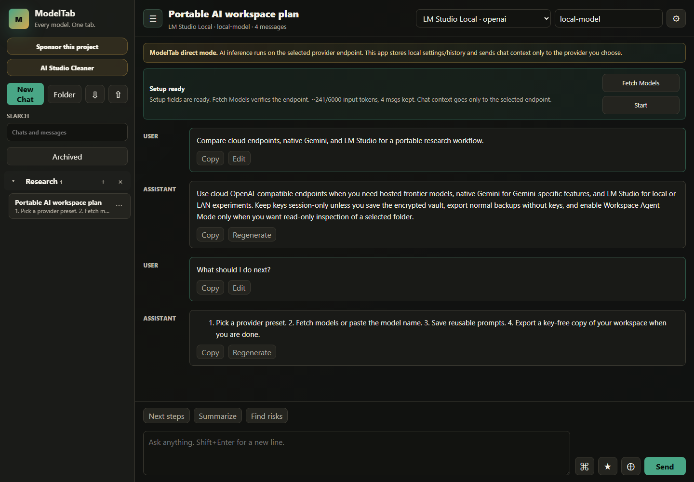

# ModelTab

<p><a href="https://github.com/sponsors/shfqrkhn?o=esb"><strong>Sponsor this project</strong></a></p>

Every model. One tab.

- **Status:** Active flagship
- **Live Demo:** [shfqrkhn.github.io/ModelTab](https://shfqrkhn.github.io/ModelTab/)
- **Latest Release:** [GitHub latest release](https://github.com/shfqrkhn/ModelTab/releases/latest)
- **Bundled Tool:** [AI Studio Cleaner](https://shfqrkhn.github.io/ModelTab/tools/ai-studio-cleaner/)
- **Portfolio Role:** Primary AI application.
- **Maintainer handoff:** [`docs/AI_MAINTAINER_HANDOFF.md`](./docs/AI_MAINTAINER_HANDOFF.md)
- **License:** MIT

ModelTab is a no-install, local-first BYOK AI chat PWA for OpenAI-compatible endpoints, local/LAN LLM servers, and native Gemini API keys. It gives users a browser-based alternative to desktop AI chat tools: bring an endpoint, bring a key when needed, and use the provider directly from the browser.

AI Studio Cleaner now lives inside this repository at `tools/ai-studio-cleaner/` as an integrated, dependency-free ModelTab utility for cleaning Google AI Studio exports into readable Markdown.

## Screenshot



## Why This Exists

Many AI chat tools require a desktop install, a hosted account, or a single provider. ModelTab keeps the workflow portable: static files, direct provider calls, local settings, and no bundled backend. It can run from GitHub Pages, a self-hosted static folder, or an extracted zip opened through `index.html`.

## What It Does

- Supports OpenAI-compatible `/chat/completions` endpoints and native Gemini APIs.
- Includes presets for OpenAI, Azure OpenAI, OpenRouter, Groq, Gemini, DeepSeek, MiniMax, Mistral, xAI, Together, Perplexity, Fireworks, Cerebras, NVIDIA NIM, DeepInfra, SambaNova, DashScope, Vercel AI Gateway, LM Studio, Ollama, llama.cpp, vLLM, LocalAI, Text Generation WebUI, and LAN endpoints.
- Provides prompt library, system prompt presets, slash prompt search, prompt variables, memory, per-chat context, image input, JSON mode, streaming, regeneration, copy/edit, and tree chat organization.
- Offers encrypted full backup, normal key-free export, import, local wipe, and browser-only operation.
- Includes optional Workspace Agent Mode for explicit selected-folder, read-only inspection with visible tool traces.
- Includes an integrated, local-only AI Studio Cleaner tool for Google AI Studio export cleanup.

## Quick Start

1. Open the live demo, self-host the static files, or download the latest release zip and open `index.html`.
2. Pick a preset for an OpenAI-compatible cloud endpoint, native Gemini, or a local/LAN server.
3. Enter base URL, model, and API key only if the endpoint requires one. Direct browser calls require the selected endpoint to allow browser CORS requests; some cloud providers block static-site browser calls.
4. For LM Studio browser use, start the local server with CORS enabled:

   ```powershell
   lms server start --cors --port 1234
   ```

5. Chat, save prompts, organize conversations, install the PWA on HTTPS/localhost when useful, and export or back up local data.

## Release And Download

- Web/PWA: use the live demo and your browser's install action.
- Local ZIP: download the [latest release](https://github.com/shfqrkhn/ModelTab/releases/latest), extract it, and open `index.html`.
- Self-host: serve this repository root from any static host. No backend or build step is required.

AI Studio export cleanup:

1. Open AI Studio Cleaner from the ModelTab sidebar, or directly through `tools/ai-studio-cleaner/`.
2. Drop or select exported Google AI Studio JSON.
3. Review, copy, or download the cleaned Markdown, then use **Back to ModelTab** to return to chat.

## Privacy And Data Model

- No account, backend, analytics, telemetry, or bundled provider key.
- Keys are session-only unless the user explicitly saves an encrypted local vault.
- Normal export never includes API keys.
- Full backup encrypts keys with a user passphrase.
- Importing a key-free export clears existing session keys and the saved local key vault to prevent stale keys from attaching to restored profiles.
- If saved local data is corrupt, ModelTab restores safe defaults and keeps a local recovery snapshot in that browser.
- Provider content is sent only to the selected endpoint.
- Workspace files are not sent unless the user explicitly attaches files. Workspace Agent Mode can share only visible, successful read-only tool trace snippets from a live selected-folder session; if no verified trace exists, local-file questions fail closed instead of guessing.

## Local And Static Hosting

- GitHub Pages: serve from the repository root.
- Zip download: extract and open `index.html` directly.
- PWA shell caching is active on HTTP/HTTPS.
- Local `file://` mode skips manifest and service-worker registration for zip-download reliability.

## Quality Gates

- Static regression gate: `npm test`
- Workspace worker gate: `npm run test:worker`
- Local-file contract smoke: `npm run test:local-file`
- Responsive visual gate: `npm run test:visual`
- Local provider smoke gate: `npm run test:provider`
- Live Pages gate after deployment: `npm run test:live`
- Before release, also run syntax checks, a secret scan, README link/media checks, local static smoke, provider setup smoke, and GitHub Pages checks.

## Relationship To Other Projects

ModelTab is the main AI flagship. AI Studio Cleaner is maintained as a bundled ModelTab tool, not a separate app surface. Future AI import, cleanup, and migration workflows should extend this repository instead of creating or reviving separate AI utility repos.

## Repository Layout

```text
.
├── index.html
├── app.js
├── styles.css
├── workspace-worker.js
├── service-worker.js
├── manifest.webmanifest
├── icons/
└── tools/
    └── ai-studio-cleaner/
```

## Maintenance

Keep the release tree minimal: only files needed to run the app, bundled tools, README, license material, and GitHub Pages metadata. Never commit API keys, local exports, full backups, or test/runtime artifacts.

## License

MIT. See `LICENSE`.
