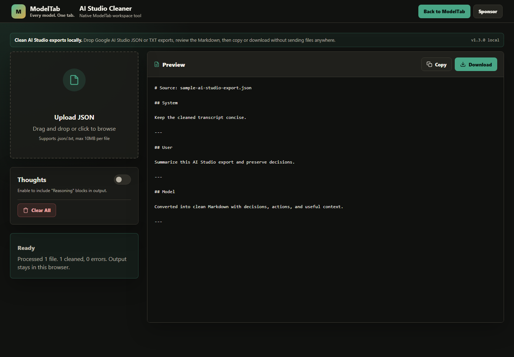

# AI Studio Cleaner

Clean Google AI Studio chat exports into readable Markdown.

- **Status:** Integrated ModelTab utility
- **Canonical Home:** [ModelTab/tools/ai-studio-cleaner](https://github.com/shfqrkhn/ModelTab/tree/main/tools/ai-studio-cleaner)
- **Live Demo:** [shfqrkhn.github.io/ModelTab/tools/ai-studio-cleaner](https://shfqrkhn.github.io/ModelTab/tools/ai-studio-cleaner/)
- **Portfolio Role:** AI utility supporting the ModelTab flagship.

AI Studio Cleaner is a native ModelTab workspace tool for parsing exported Google AI Studio conversation JSON files and converting them into clean Markdown, optionally including or hiding model reasoning blocks. It uses the ModelTab header, shared navigation language, direct return path to the chat workspace, and no third-party runtime dependency.

## Screenshot



## Why This Exists

AI Studio exports are useful but noisy. This tool turns them into portable, readable documents for review, archiving, migration, and reuse.

## What It Does

- Accepts Google AI Studio JSON export files in the browser.
- Handles common export shapes such as chunks and parts.
- Lets users include or omit thinking/reasoning blocks.
- Previews generated Markdown.
- Copies or downloads the cleaned output.
- Runs as static files with no backend, no CDN runtime, and no network dependency for normal use.

## Quick Start

1. Open the tool from the ModelTab sidebar, or open the live demo.
2. Drop or select one or more AI Studio JSON export files.
3. Choose whether to include reasoning blocks.
4. Review the Markdown.
5. Copy or download the result.

## Privacy And Data Model

- Files are processed locally in the browser.
- No server upload is required for normal use.
- No account, telemetry, or bundled API key.
- Users should review cleaned output before sharing it externally.

## Relationship To Other Projects

This utility is maintained as an integrated ModelTab tool. Keep it focused on AI Studio export cleanup; broader AI chat, BYOK provider setup, and future import workflows belong in the parent app.

## Repository Layout

```text
tools/ai-studio-cleaner/
├── index.html
├── screenshot.png
├── package.json
├── benchmark_*.js
└── simulation_stress_test.js
```

## Deployment

Open it from the ModelTab sidebar, open `index.html` locally, or serve it through the ModelTab GitHub Pages deployment at `/ModelTab/tools/ai-studio-cleaner/`.

## Maintenance

Maintenance-only unless Google AI Studio changes its export format or the parser needs compatibility updates.

## License

See `LICENSE`.
